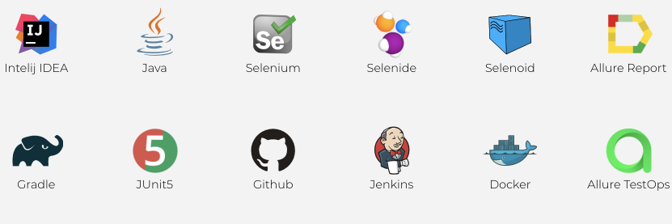
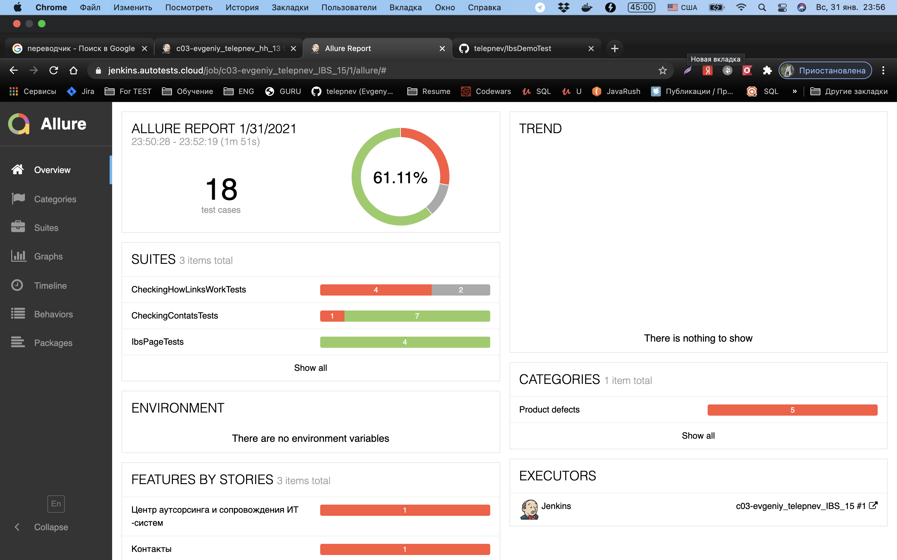
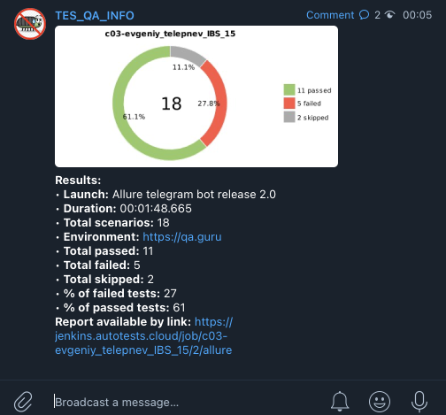

## Для автотестов был использован сайт `IBS`  `https://ibs.ru/`

Используемые технологии:

По ходу обучения  буду прикручивать новые технологии и фишки к данному проекту.
Было написано 18 тестов.
Найдено пару некритичных багов, баг репорт приложен ниже.

**Общая статистика.**

.png)

**Пример отчета с ошибкой. Тест был специально испорчен.**

**Битый линк на YouTube**

После прохождения тестов в Телеграм Чат приходит сообщение

------------------------------------------------------------------

Пару дефектов которых я нашел 

+№1+

**Кривая верстка на мобильном устройстве**

`Summary`

Incorrect layout of the outsourcing Center page when you click on "reCaptcha"

`Steps to reproduce`
1. Open outsourcing center and maintenance of IT systems page;
2. Go to the bottom of the page;
3. Click on "reCaptcha"

`Actual result`

the user cannot fill out the form

`Expected result`

the user fills out the form

`Build version`

N/A

`Platform`

HONOR P20 Pro

Android 10; YAL-L41 Build/HUAWEIYAL-L41

Chrome 87.0.4280.101

`Priority`

Minor

`Severity`

Minor

`Attachment`

------------------------------------------------------------------

+№2+

**Нерабочая ссылка**

`Summary`

Broken YouTube link on the outsourcing center page

`Steps to reproduce`
1. Open outsourcing center and maintenance of IT systems page;
2. Go to the bottom of the page;
3. Click on "YouTube"

`Actual result`

the user can't click on the link to the page YouTube

`Expected result`

the user goes to the page YouTube

`Build version`

N/A

`Platform`

macOS Catalina 10.15.7

`Priority`

Low

`Severity`

Low

`Attachment`

------------------------------------------------------------------

+№3+

**Нет возможности просмотреть вакансии с мобильного телефона**

`Summary`

On the main Job page, the user cannot click on links with vacancies

`Steps to reproduce`

1. Open main page;
1. Go to the all vacancies page
2. Set the filter all cities and all vacancies;
3. Click on any link with a drop-down list of vacancies

`Actual result`

The user cannot go to vacancies

`Expected result`

The user clicks on the link and searches for vacancies

`Build version`

N/A

`Platform`

HONOR P20 Pro 

Android 10; YAL-L41 Build/HUAWEIYAL-L41

Chrome 87.0.4280.101

`Priority`

Minor

`Severity`

Minor

`Attachment`

### `link for video screen` **https://yadi.sk/i/4CDHUdnD7_Seew**

        